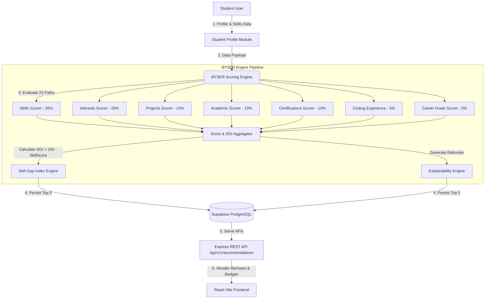

# PATHFORGE Phase 3 Architecture — BYSER Recommendation & Explainability Engine

## Data Flow Summary
1. **Student Profile Retrieval**: The engine collects student skills, proficiencies (1-5), projects, CGPA, interests, certifications, and career goals.
2. **Deterministic Evaluation**: Each of the 23 database-configured `CareerPath` options is evaluated against the 7 weighted factors defined in `byserWeights.ts`.
3. **SGI Calculation**: The Skill Gap Index is computed as `100 - SkillScore` and categorized into 5 tiers (`Excellent Match`, `Good Match`, `Moderate Gap`, `Large Gap`, `Critical Gap`).
4. **Explainability Generation**: Strengths, actionable areas to improve, and missing skill priorities (`HIGH`, `MEDIUM`, `LOW`) are generated deterministically without opaque AI black-boxes.
5. **Interactive Visualization**: Top 5 recommendations, side-by-side comparison, and analytics charts are presented using Recharts and Tailwind UI cards.
