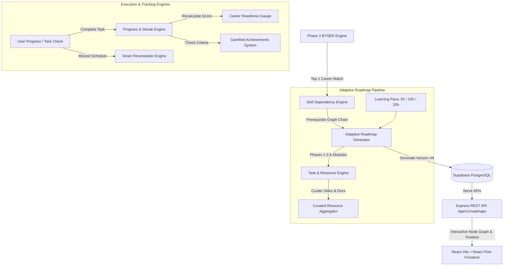

# PathForge Phase 4 Architecture — Intelligent Adaptive Learning & Career Execution Ecosystem

## Data Flow Summary
1. **BYSER Seed Input**: Takes top-ranked career recommendation from Phase 3 BYSER engine.
2. **Skill Dependency Resolution**: `skillDependencyEngine.ts` guarantees prerequisite ordering (e.g. HTML $\rightarrow$ CSS $\rightarrow$ JS $\rightarrow$ React $\rightarrow$ TypeScript).
3. **Pace-based Duration**: Dynamically computes estimated weeks based on target weekly hours (`FAST`: 20h, `MEDIUM`: 10h, `SLOW`: 5h).
4. **Interactive Timeline & Skill Graph**: Renders expandable phase timeline and React Flow node tree on the frontend.
5. **Real-time Gamification**: Updates Career Readiness score (0-100), habit streaks, and unlocks trophies automatically upon task completions.
