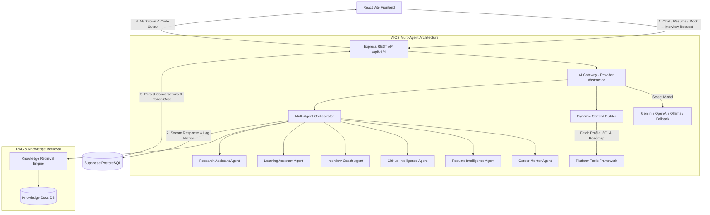

# PATHFORGE Phase 5 Architecture — AI Operating System (AIOS) for Career Intelligence

## Data Flow Summary
1. **Client Request**: Frontend sends queries to `/api/v1/ai/chat`, `/api/v1/ai/resume`, or `/api/v1/ai/interview`.
2. **Provider-Independent AI Gateway**: `aiGateway.ts` isolates provider details, tracking token input/output, latency (ms), and cost ($).
3. **Platform Context Grounding**: `platformTools.ts` retrieves real student profile data, BYSER scores, and roadmap progress to ground agent responses without data hallucination.
4. **Multi-Agent Execution**: `multiAgentOrchestrator.ts` routes to specialized agents (Career Mentor, Resume Intelligence, GitHub Intelligence, Interview Coach, Research Assistant).
5. **Session History & Analytics**: All messages and token usage metrics (`AiMetric`) are stored in PostgreSQL for continuous observability.
